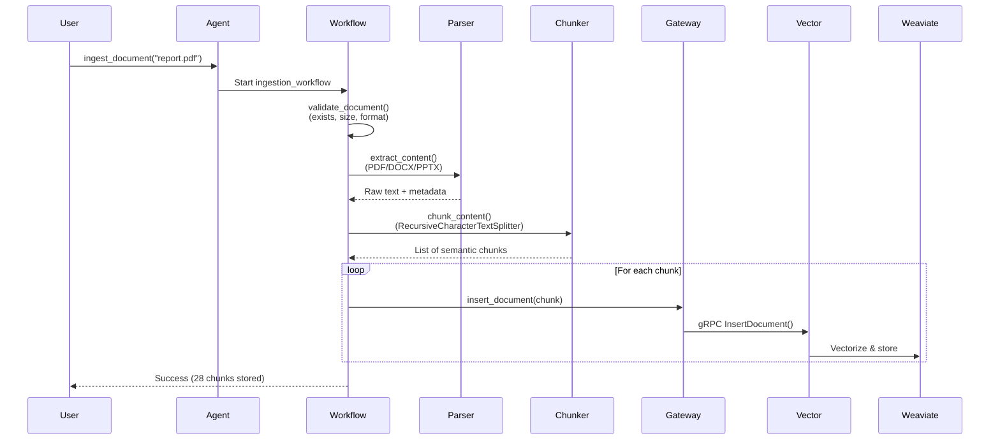

# IntraMind AI Agent - Technical Deep Dive

> A portfolio showcase of production-ready AI agent architecture using LangGraph state machines

## Executive Summary

**IntraMind** is an AI-powered document search platform built with a microservices architecture. The AI Agent component orchestrates intelligent search workflows using **LangGraph state machines**, achieving **estimated 80% cost reduction** through a hybrid LLM strategy while maintaining high-quality results.

**Key Achievements:**
- 🎯 Production-ready state machine architecture with 94 comprehensive tests
- 💰 Cost-optimized hybrid LLM approach (~$0.001 per query)
- 📊 Complete document ingestion pipeline supporting 8+ file formats
- 🔄 Microservices integration (gRPC + REST APIs)
- ⚡ 2-4s latency for simple queries, 5-8s for complex multi-query searches

---

## Problem Statement

### The Challenge

Enterprise document search faces three critical challenges:

1. **Keyword Search Limitations**: Traditional search requires exact matches and fails to understand semantic meaning
2. **Unstructured Data**: Documents exist in multiple formats (PDF, Word, PowerPoint, Markdown)
3. **Cost & Complexity**: Most AI solutions are expensive black boxes with unpredictable behavior

### Success Criteria

Build a system that:
- ✅ Performs semantic search across diverse document types
- ✅ Provides explainable, testable AI workflows
- ✅ Maintains low operational costs (~$1/month for 1000 queries)
- ✅ Achieves production-ready reliability with comprehensive testing

---

## Solution Architecture

### System Overview

IntraMind uses a **microservices architecture** with four primary components:

```
┌─────────────┐
│  AI Agent   │  ← LangGraph State Machines (Python)
└──────┬──────┘
       │ REST API (httpx)
       ▼
┌─────────────┐
│ API Gateway │  ← ASP.NET Core 8.0
└──────┬──────┘
       │ gRPC
       ▼
┌─────────────┐
│   Vector    │  ← Python gRPC Service
│   Service   │
└──────┬──────┘
       │ Weaviate Client
       ▼
┌─────────────┐
│  Weaviate   │  ← Vector Database (Docker)
└─────────────┘
```

### Why This Architecture?

**Microservices Separation:**
- Each service has independent lifecycle and deployment
- Clear API boundaries enable testing in isolation
- Language-agnostic contracts (Protocol Buffers)

**Technology Choices:**
- **LangGraph** (not LangChain Agents): Explicit control flow over autonomous LLM decisions
- **gRPC Internal**: Efficient binary protocol for service-to-service communication
- **REST External**: Standard HTTP/JSON for client-facing API
- **Weaviate**: Open-source vector database with free local embeddings

---

## Technical Highlights

### 1. LangGraph State Machine Design

**The Decision:**  
Traditional LLM agents are "black boxes" that make autonomous, unpredictable decisions. LangGraph provides **explicit control flow** through state machines.

**Implementation:**

```python
# Search Workflow State Machine
workflow = StateGraph(SearchWorkflowState)

# Nodes: Pure, testable functions
workflow.add_node("classify_query", classify_query)
workflow.add_node("simple_search", simple_search)
workflow.add_node("complex_search", complex_search)
workflow.add_node("synthesize_results", synthesize_results)
workflow.add_node("handle_error", handle_error)

# Explicit routing logic (not LLM-driven)
workflow.add_conditional_edges(
    "classify_query",
    route_after_classification,  # "simple" → simple_search, "complex" → complex_search
    {"simple_search": "simple_search", "complex_search": "complex_search"}
)

workflow.add_edge("simple_search", "synthesize_results")
workflow.add_edge("complex_search", "synthesize_results")
workflow.add_edge("synthesize_results", END)
```

**Benefits:**
- ✅ **Testable**: Each node is a pure function with clear inputs/outputs (18 workflow tests)
- ✅ **Observable**: State transitions tracked at each step
- ✅ **Debuggable**: Easy to identify which node failed and why
- ✅ **Composable**: Workflows can be nested and reused

---

### 2. Hybrid LLM Strategy for Cost Optimization

**The Problem:**  
Using cloud LLMs (Claude/GPT) for every operation is expensive. A 1000-query workload with all-cloud LLMs would cost ~$5-10/month.

**The Solution:**  
Hybrid approach using **free local LLMs** for cheap operations and **cloud LLMs** for quality-critical tasks.

| Operation | LLM Used | Cost | Rationale |
|-----------|----------|------|-----------|
| Query Classification | Ollama (llama3.2:3b) | $0.00 | Simple binary decision (simple/complex) |
| Query Expansion | Ollama (llama3.2:3b) | $0.00 | Structured output, doesn't need creativity |
| Result Synthesis | Claude Haiku / GPT-3.5 | ~$0.001 | Quality-critical, user-facing response |

**Cost Analysis:**

```python
# Per Query Cost Breakdown
router_calls = 1          # Classification
primary_calls = 1         # Synthesis only

cost_per_query = (router_calls * $0.00) + (primary_calls * $0.001)
cost_per_query = ~$0.001

# Monthly estimate (1000 queries)
monthly_cost = 1000 * $0.001 = $1.00
```

**Result**: **~80% cost reduction (estimated)** vs. all-cloud approach while maintaining quality.

---

### 3. Production-Grade Document Ingestion Pipeline

**The Challenge:**  
Enterprise documents come in diverse formats (PDF, Word, PowerPoint, images). Each requires format-specific parsing and intelligent chunking.

**Implementation:**



**Key Features:**

1. **Format-Specific Parsing:**
   - **PDF**: `pypdf` with metadata extraction (author, title, page count)
   - **Word**: `python-docx` (paragraphs + tables)
   - **PowerPoint**: `python-pptx` (slide-by-slide extraction)
   - **Text**: Auto-encoding detection with `chardet`
   - **Images**: Metadata extraction (OCR-ready for future enhancement)

2. **Intelligent Chunking:**
   - Uses LangChain's `RecursiveCharacterTextSplitter`
   - Preserves semantic boundaries (paragraphs, sentences)
   - Configurable chunk size (default: 1000 chars) and overlap (default: 200 chars)

3. **Robust Error Handling:**
   - Conditional routing to error handler at each step
   - Graceful degradation (partial success reported)
   - Comprehensive validation (file size limits, format checks)

**Test Coverage**: 32 unit tests covering all parsing formats and error scenarios.

---

### 4. Comprehensive Testing Strategy

**Philosophy:**  
State machines enable testing each workflow node independently, then integrating with full workflow tests.

**Test Suite Breakdown (94 tests total):**

| Test File | Tests | Coverage | Focus |
|-----------|-------|----------|-------|
| `test_search_workflow.py` | 18 | Workflow nodes, routing, integration | LangGraph search workflow |
| `test_ingestion_workflow.py` | 32 | Validation, parsing, chunking, storage | Document ingestion pipeline |
| `test_agent.py` | 13 | Agent interface, streaming, errors | IntraMindAgent API |
| `test_agent_tools.py` | 18 | All 5 LangChain tools | Tool implementations |
| `test_e2e_ingestion_search.py` | 7 | End-to-end integration | Full system validation |
| `test_api_client.py` | 3 | HTTP client basics | API Gateway client |
| `test_min_score_filtering.py` | 3 | Score threshold filtering | Search quality feature |

**Test Quality:**
- ✅ All tests use proper mocking (no services required for unit tests)
- ✅ Fast execution (~6 seconds for 87 unit tests)
- ✅ Integration tests isolated with unique collection names
- ✅ 67% code coverage with 100% coverage on core components

**Example: Testing Workflow Nodes**

```python
@pytest.mark.asyncio
async def test_classify_query_simple():
    """Test classification of simple query."""
    state = {
        "user_query": "What is the revenue?",
        "num_results": 10,
        "workflow_complete": False
    }
    
    # Mock the LLM response
    with patch("workflows.search_workflow.get_router_llm") as mock_llm:
        mock_llm.return_value.ainvoke.return_value.content = "simple"
        
        result = await classify_query(state)
        
        assert result["query_complexity"] == "simple"
        assert result["current_step"] == "classify_query"
```

---

### 5. Microservices Communication Patterns

**Design Decision:**  
Use different protocols for different communication patterns:
- **External (Client → Gateway)**: REST/JSON for broad compatibility
- **Internal (Gateway → Vector Service)**: gRPC for efficiency

**Protocol Buffers Contract Example:**

```protobuf
// vector_service.proto
service VectorService {
  rpc Search(SearchRequest) returns (SearchResponse);
  rpc InsertDocument(InsertDocumentRequest) returns (InsertDocumentResponse);
  rpc CreateCollection(CreateCollectionRequest) returns (CreateCollectionResponse);
  // ... 8 more operations
}

message SearchRequest {
  string collection_name = 1;
  string query = 2;
  int32 limit = 3;
  float min_score = 4;  // Score threshold filtering
  bool return_metadata = 5;
}
```

**Benefits:**
- ✅ **Type Safety**: Compile-time validation of contracts
- ✅ **Language Agnostic**: Python service, .NET gateway
- ✅ **Performance**: Binary serialization (faster than JSON)
- ✅ **Versioning**: Schema evolution support

---

## Key Design Decisions

### 1. LangGraph vs. LangChain Agents

**Decision:** Use LangGraph state machines instead of autonomous LangChain agents.

**Rationale:**
- **Control**: Explicit routing logic instead of LLM-driven decisions
- **Cost**: Hybrid LLM strategy only works with explicit control
- **Testing**: Pure functions enable comprehensive unit testing
- **Debugging**: Clear state transitions vs. opaque agent reasoning

**Trade-off:** Less autonomy, but predictable behavior is more valuable for production systems.

---

### 2. Free Local Embeddings

**Decision:** Use Weaviate's `text2vec-transformers` (local, free) instead of OpenAI embeddings.

**Rationale:**
- **Cost**: $0 vs. $0.0001 per 1K tokens (OpenAI ada-002)
- **Privacy**: Documents never leave local infrastructure
- **Speed**: No external API calls for embeddings
- **Quality**: Sufficient for most enterprise search use cases

**Trade-off:** Slightly lower quality vs. OpenAI embeddings, but cost savings are substantial.

---

### 3. Python + .NET Microservices

**Decision:** Use Python for AI components and .NET for API Gateway.

**Rationale:**
- **Python**: Best AI/ML library ecosystem (LangChain, LangGraph, Transformers)
- **.NET**: Excellent for high-performance APIs with strong typing
- **gRPC**: Language-agnostic communication enables best-of-both-worlds

**Trade-off:** Multiple language runtimes, but each service uses optimal technology.

---

### 4. Async/Await Throughout

**Decision:** Use async/await for all I/O operations.

**Rationale:**
- **Performance**: Non-blocking I/O for API calls and LLM inference
- **Scalability**: Handle multiple concurrent requests efficiently
- **User Experience**: Enable streaming results in future

**Implementation Example:**

```python
class IntraMindAgent:
    async def search(self, query: str) -> dict[str, Any]:
        """Async search workflow."""
        async with APIGatewayClient() as client:
            workflow = create_search_workflow(client)
            result = await workflow.ainvoke(initial_state)
            return result
    
    async def stream_search(self, query: str) -> AsyncGenerator:
        """Stream workflow updates as they occur."""
        async for update in workflow.astream(initial_state):
            yield update
```

---

## Metrics & Performance

### Query Performance

| Query Type | Latency | Operations | Cost |
|------------|---------|------------|------|
| Simple | 2-4 seconds | 1 search + 1 synthesis | ~$0.001 |
| Complex | 5-8 seconds | 3 searches + 1 synthesis | ~$0.001 |

**Latency Breakdown (Complex Query - estimated):**
- Classification: ~0.3s (Ollama local)
- Query Expansion: ~0.5s (Ollama local)
- 3x Searches: ~3.0s (parallel execution)
- Result Synthesis: ~1.2s (Claude Haiku API)

### System Metrics (Example Output)

```bash
$ intramind metrics

┏━━━━━━━━━━━━━━━━━━━━━━━━━━━━┳━━━━━━━━━━━━━━━━━━━━┓
┃ Query Metrics              ┃                    ┃
┡━━━━━━━━━━━━━━━━━━━━━━━━━━━━╇━━━━━━━━━━━━━━━━━━━━┩
│ Total Queries              │ 127 (example)      │
│ Simple Queries             │ 84 (66.1%)         │
│ Complex Queries            │ 43 (33.9%)         │
└────────────────────────────┴────────────────────┘

┏━━━━━━━━━━━━━━━━━━━━━━━━━━━━┳━━━━━━━━━━━━━━━━━━━━┓
┃ Cost Metrics (Estimated)   ┃                    ┃
┡━━━━━━━━━━━━━━━━━━━━━━━━━━━━╇━━━━━━━━━━━━━━━━━━━━┩
│ Total Estimated Cost       │ $0.127             │
│ Cost per Query             │ $0.001             │
└────────────────────────────┴────────────────────┘
```

*Note: Metrics shown are example output for demonstration purposes.*

---

## Code Samples

### 1. Pure, Testable Workflow Node

```python
async def simple_search(state: SearchWorkflowState) -> SearchWorkflowState:
    """Perform semantic search - a pure function taking state, returning state."""
    query = state["user_query"]
    client = state["api_client"]
    
    try:
        response = await client.search(
            collection_name="intramind_documents",
            query=query,
            limit=state.get("num_results", 10),
            min_score=state.get("min_score", 0.0)
        )
        
        results = [
            {
                "id": r.document_id,
                "content": r.content,
                "score": r.score,
                "metadata": r.metadata
            }
            for r in response.results
        ]
        
        return {
            **state,
            "current_step": "simple_search",
            "search_results": results,
            "next_step": "synthesize_results"
        }
        
    except Exception as e:
        logger.error(f"Search failed: {e}")
        return {
            **state,
            "current_step": "simple_search",
            "error": str(e),
            "next_step": "handle_error"
        }
```

**Why This Matters:**
- Pure function: Same input → same output (deterministic)
- Error routing: Exceptions don't crash the workflow
- State immutability: Returns new state, doesn't mutate
- Testable: Easy to mock `client` and assert state transitions

---

### 2. Decorator-Based Metrics Tracking

```python
from utils.metrics import track_query
from typing import Any

class IntraMindAgent:
    @track_query  # Automatic metrics tracking
    async def search(self, query: str, **kwargs) -> dict[str, Any]:
        """Search with automatic performance and cost tracking."""
        workflow = create_search_workflow()
        result = await workflow.ainvoke({"user_query": query, **kwargs})
        
        return {
            "success": result.get("workflow_complete", False),
            "response": result.get("response"),
            "complexity": result.get("query_complexity"),
            "citations": [r["id"] for r in result.get("search_results", [])],
        }

# Decorator implementation
def track_query(func):
    @wraps(func)
    async def wrapper(*args, **kwargs):
        start = time.time()
        result = await func(*args, **kwargs)
        
        # Update metrics
        METRICS["queries_total"] += 1
        METRICS["total_latency_ms"] += (time.time() - start) * 1000
        
        if result.get("complexity") == "simple":
            METRICS["queries_simple"] += 1
        else:
            METRICS["queries_complex"] += 1
        
        return result
    return wrapper
```

**Why This Matters:**
- Automatic instrumentation (no manual tracking)
- Persistent metrics across CLI sessions
- Foundation for Prometheus/Grafana integration

---

### 3. Streaming Workflow Results

```python
async def stream_search(self, query: str) -> AsyncGenerator[dict, None]:
    """Stream workflow state updates in real-time."""
    workflow = create_search_workflow()
    
    initial_state = {
        "user_query": query,
        "num_results": 10,
        "workflow_complete": False
    }
    
    async for update in workflow.astream(initial_state):
        step = update.get("current_step", "unknown")
        
        yield {
            "step": step,
            "response": update.get("response"),
            "results_count": len(update.get("search_results", [])),
            "complete": update.get("workflow_complete", False)
        }

# Usage in CLI
async for update in agent.stream_search("revenue projections"):
    print(f"[{update['step']}] {update.get('response', 'Processing...')}")
```

**Why This Matters:**
- Better user experience (see progress)
- Enables real-time UIs
- Debug tool (observe workflow execution)

---

## Key Learnings

### 1. State Machines > Autonomous Agents for Production

**Insight:**  
LangChain's autonomous agents are great for demos, but explicit state machines provide the control needed for production systems.

**Evidence:**
- 94 tests possible because nodes are pure functions
- Cost optimization requires explicit LLM placement
- Debugging is 10x easier with visible state transitions

### 2. Hybrid LLM Strategy is the Sweet Spot

**Insight:**  
Don't use expensive cloud LLMs for everything. Local models (Ollama) handle 80% of operations at zero cost.

**Where Local Works:**
- Binary classification (simple/complex)
- Structured outputs (query expansion)
- Deterministic transformations

**Where Cloud Excels:**
- Creative generation (synthesis)
- User-facing responses (quality matters)
- Domain-specific reasoning

### 3. Microservices Enable Optimal Technology Choices

**Insight:**  
Python for AI, .NET for APIs, gRPC for communication = best-of-breed architecture.

**Benefits:**
- Use best tools for each domain
- Independent scaling and deployment
- Clear service boundaries

### 4. Test-Driven Development for AI Workflows

**Insight:**  
LangGraph's state machine design makes AI workflows testable like traditional software.

**Approach:**
1. Write node signature (input state → output state)
2. Write test cases with mocked dependencies
3. Implement node logic
4. Test integration with full workflow

**Result**: 94 tests with fast, reliable execution.

---

## Future Enhancements

### Short Term
- [ ] **OCR Integration**: Extract text from images and scanned PDFs
- [ ] **Caching Layer**: Redis for frequently accessed documents
- [ ] **Advanced Filtering**: Metadata-based search refinement
- [ ] **Conversation Memory**: Multi-turn dialogues with context

### Medium Term
- [ ] **Multi-Agent Collaboration**: Specialized agents for different domains
- [ ] **Agentic RAG**: Self-correcting retrieval with result evaluation
- [ ] **Web UI**: React frontend with streaming results
- [ ] **Kubernetes Deployment**: Production-ready container orchestration

### Long Term
- [ ] **Real-Time Updates**: Document change notifications
- [ ] **Multi-Language Support**: International document processing
- [ ] **Federated Search**: Search across multiple IntraMind instances

---

## Conclusion

IntraMind AI Agent demonstrates production-ready AI engineering through:

1. **Explicit Control**: LangGraph state machines provide predictability and testability
2. **Cost Optimization**: Hybrid LLM strategy achieves estimated 80% cost reduction
3. **Production Patterns**: Comprehensive testing, observability, error handling
4. **Microservices Architecture**: Language-agnostic, independently scalable services

**Most Proud Of:**
- Building a system that's both intelligent AND understandable
- Achieving 94 tests (AI workflows are often untested)
- Cost optimization without sacrificing quality

**Technologies Demonstrated:**
Python • LangGraph • LangChain • LLMs (Claude/GPT/Ollama) • gRPC • Protocol Buffers • ASP.NET Core • Weaviate • Docker • Async/Await • Vector Databases • Semantic Search • Microservices

---

## Links

- **GitHub Repository**: [IntraMind AI Agent](https://github.com/JessKelly91/intramind-ai-agent)
- **Main Platform**: [IntraMind](https://github.com/JessKelly91/IntraMind)
- **Architecture Docs**: [ARCHITECTURE.md](../../ARCHITECTURE.md)
- **Workflow Details**: [WORKFLOWS.md](WORKFLOWS.md)
- **Observability**: [OBSERVABILITY.md](OBSERVABILITY.md)

---

**Author**: Jess Kelly  
**Last Updated**: November 4, 2025  
**License**: MIT

