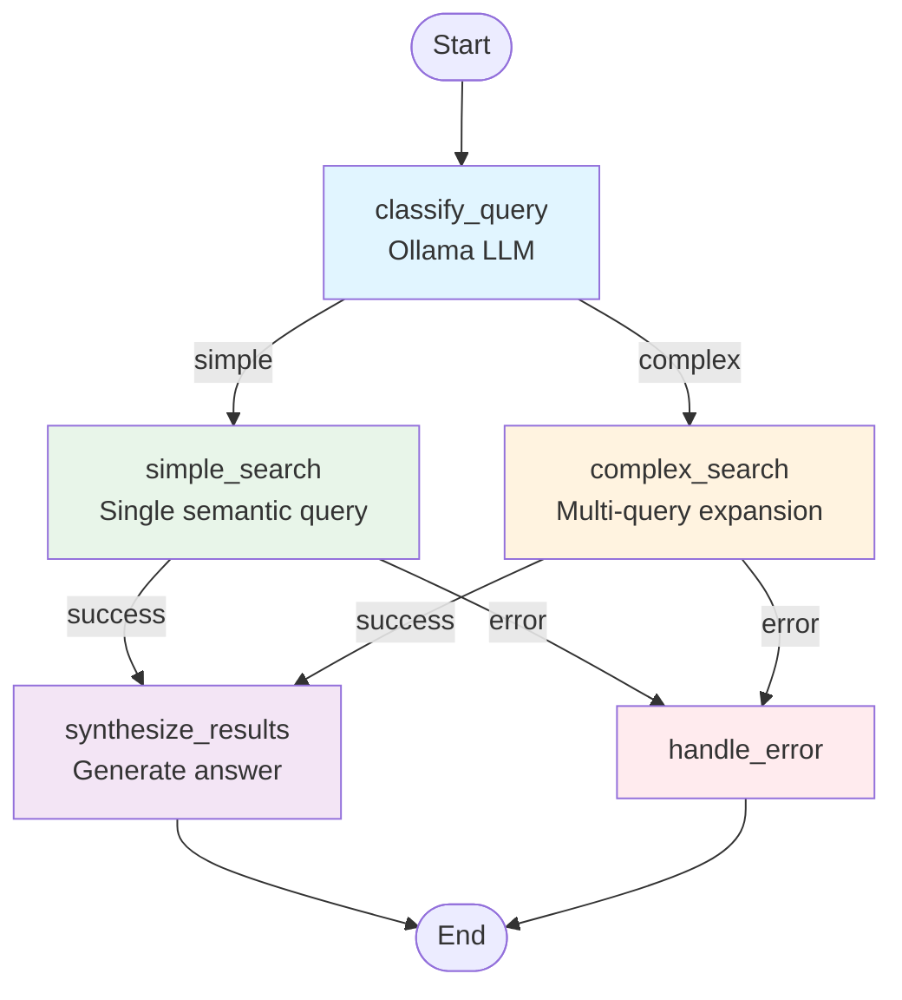
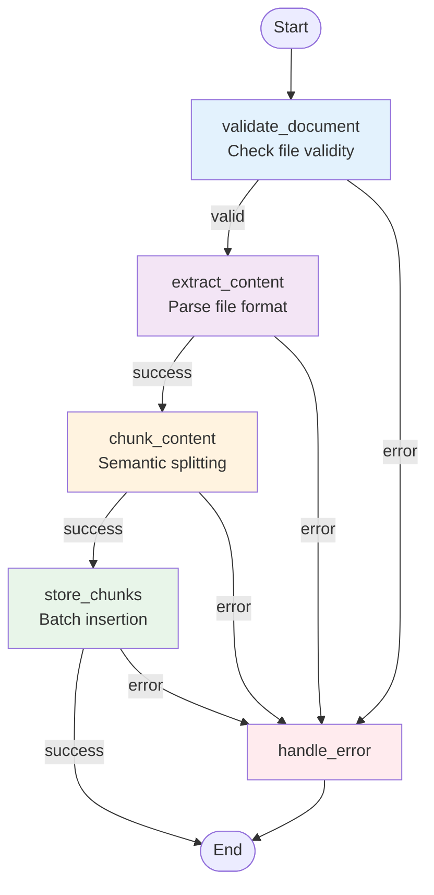

# IntraMind AI Agent - LangGraph Workflows

> Detailed documentation for LangGraph state machine workflows in the IntraMind AI Agent

## Table of Contents

1. [Overview](#overview)
2. [Search Workflow](#search-workflow)
3. [Ingestion Workflow](#ingestion-workflow)
4. [State Management](#state-management)
5. [Extending Workflows](#extending-workflows)
6. [Testing Workflows](#testing-workflows)

---

## Overview

The IntraMind AI Agent uses **LangGraph** to implement workflows as explicit state machines. This approach provides:

- **Testability**: Each node is a pure function that can be tested independently
- **Observability**: Clear visibility into workflow execution and state transitions
- **Debuggability**: Easy to trace execution path and identify issues
- **Composability**: Workflows can be composed and reused
- **Error Handling**: Explicit error routing at each step

### Why LangGraph?

Traditional LLM agents are opaque "black boxes" that make autonomous decisions. LangGraph provides:

1. **Explicit Control Flow**: You define the routing logic, not the LLM
2. **Predictable Behavior**: State transitions follow defined rules
3. **Cost Control**: Use LLMs only where needed (hybrid strategy)
4. **Production-Ready**: Better error handling and recovery patterns

---

## Search Workflow

### Workflow Overview

The search workflow orchestrates semantic document search with intelligent query routing.



Prompts for `classify_query`, `complex_search`, and `synthesize_results` are resolved through `src/prompts/client.py`. When `PROMPT_REGISTRY_URL` is configured, the client fetches the active label from Prompt Registry with a TTL cache; otherwise, or on any registry error, it falls back to the baked-in `src/prompts/registry.py` prompt. Search workflow spans annotate `prompt.id`, `prompt.version`, `prompt.hash`, `prompt.label`, and `prompt.source` for Phoenix.

### State Definition

```python
class SearchWorkflowState(AgentState):
    """State for document search workflow."""
    
    # Inherited from AgentState
    user_query: str                              # User's search query
    current_step: str                            # Current workflow node
    next_step: str | None                        # Next node to execute
    workflow_complete: bool                      # Completion flag
    search_results: list[dict[str, Any]] | None  # Search results
    num_results: int                             # Max results to return
    response: str | None                         # Final synthesized response
    error: str | None                            # Error message if any
    
    # Search-specific fields
    query_complexity: str | None                 # "simple" or "complex"
    expanded_queries: list[str] | None           # For complex queries
    aggregated_results: list[dict[str, Any]] | None
    min_score: float                             # Score threshold (0.0-1.0)
```

---

### Node 1: classify_query

**Purpose**: Determine query complexity to route to appropriate search strategy.

**Implementation**:
```python
async def classify_query(state: SearchWorkflowState) -> SearchWorkflowState:
    """Classify the query complexity."""
    query = state["user_query"]
    router_llm = get_router_llm()  # Ollama (free)
    prompt = get_prompt("query_classifier")
    annotate_span(prompt)
    
    response = await router_llm.ainvoke([
        SystemMessage(content=prompt.template),
        HumanMessage(content=f"Classify: {query}")
    ])
    
    complexity = response.content.strip().lower()
    
    return {
        **state,
        "current_step": "classify_query",
        "query_complexity": complexity,
        "next_step": "simple_search" if complexity == "simple" else "complex_search"
    }
```

**Routing Logic**:
```python
def route_after_classification(state: SearchWorkflowState):
    complexity = state.get("query_complexity", "simple")
    return "simple_search" if complexity == "simple" else "complex_search"
```

**Examples**:
- **Simple**: "What are our revenue projections?" → Direct semantic search
- **Complex**: "Compare Q3 and Q4 performance across departments" → Multi-query expansion

---

### Node 2a: simple_search

**Purpose**: Perform straightforward semantic search for simple queries.

**Flow**:
1. Extract query from state
2. Call API Gateway search endpoint
3. Return results with scores
4. Route to synthesis

**Implementation**:
```python
async def simple_search(state: SearchWorkflowState) -> SearchWorkflowState:
    """Perform semantic search."""
    query = state["user_query"]
    client = get_api_client()
    
    try:
        response = await client.search(
            collection_name=state.get("document_metadata", {}).get(
                "collection_name", "intramind_documents"
            ),
            query=query,
            limit=state.get("num_results", 10),
            min_score=state.get("min_score", 0.0)  # Score filtering
        )
        
        results = [
            {
                "id": result.document_id,
                "content": result.content,
                "metadata": result.metadata,
                "score": result.score
            }
            for result in response.results
        ]
        
        return {
            **state,
            "current_step": "simple_search",
            "search_results": results,
            "next_step": "synthesize_results"
        }
        
    except Exception as e:
        return {
            **state,
            "current_step": "simple_search",
            "error": str(e),
            "next_step": "handle_error"
        }
```

**Key Features**:
- **Score Filtering**: `min_score` parameter filters low-quality results
- **Error Handling**: Exceptions routed to error handler
- **Metadata Preservation**: Full metadata passed through

---

### Node 2b: complex_search

**Purpose**: Handle complex queries with multi-query expansion.

**Flow**:
1. Use LLM to expand query into 2-3 sub-queries
2. Execute each sub-query in parallel
3. Deduplicate results by document ID
4. Merge and sort by score
5. Route to synthesis

**Implementation**:
```python
async def complex_search(state: SearchWorkflowState) -> SearchWorkflowState:
    """Complex search with query expansion."""
    query = state["user_query"]
    router_llm = get_router_llm()
    prompt = get_prompt("query_expansion")
    annotate_span(prompt)
    
    response = await router_llm.ainvoke([
        SystemMessage(content=prompt.template),
        HumanMessage(content=f"Expand: {query}")
    ])
    
    # Parse numbered list
    expanded_queries = []
    for line in response.content.strip().split("\n"):
        if line and line[0].isdigit():
            expanded_query = line.split(".", 1)[1].strip()
            expanded_queries.append(expanded_query)
    
    # Execute searches
    client = get_api_client()
    all_results = []
    seen_ids = set()
    
    for expanded_query in expanded_queries:
        try:
            response = await client.search(
                collection_name=state.get("document_metadata", {}).get(
                    "collection_name", "intramind_documents"
                ),
                query=expanded_query,
                limit=5,  # Fewer per query
                min_score=state.get("min_score", 0.0)
            )
            
            # Deduplicate
            for result in response.results:
                if result.document_id not in seen_ids:
                    seen_ids.add(result.document_id)
                    all_results.append({
                        "id": result.document_id,
                        "content": result.content,
                        "metadata": result.metadata,
                        "score": result.score
                    })
        except Exception as e:
            logger.warning(f"Search failed for '{expanded_query}': {e}")
    
    # Sort by score and limit
    all_results.sort(key=lambda x: x.get("score", 0), reverse=True)
    all_results = all_results[:state.get("num_results", 10)]
    
    return {
        **state,
        "current_step": "complex_search",
        "expanded_queries": expanded_queries,
        "search_results": all_results,
        "next_step": "synthesize_results"
    }
```

**Advantages**:
- **Broader Coverage**: Multiple perspectives on the query
- **Better Recall**: Catches documents missed by single query
- **Deduplication**: No duplicate results in final output
- **Fault Tolerance**: Partial failures don't stop workflow

---

### Node 3: synthesize_results

**Purpose**: Generate natural language answer from search results.

**Flow**:
1. Gather top 5 results for context
2. Truncate long content (500 chars max)
3. Use LLM to synthesize answer
4. Include document citations
5. Mark workflow complete

**Implementation**:
```python
async def synthesize_results(state: SearchWorkflowState) -> SearchWorkflowState:
    """Synthesize search results into coherent response."""
    query = state["user_query"]
    results = state.get("search_results", [])
    
    if not results:
        return {
            **state,
            "current_step": "synthesize_results",
            "response": "I couldn't find any relevant documents.",
            "citations": [],
            "workflow_complete": True
        }
    
    primary_llm = get_primary_llm()  # Can be Ollama or cloud LLM
    
    # Build context
    context_parts = []
    citations = []
    
    for i, result in enumerate(results[:5], 1):
        content = result["content"][:500]
        context_parts.append(f"[Document {i}]\n{content}\n")
        citations.append(result["id"])
    
    context = "\n".join(context_parts)
    
    prompt = get_prompt("result_synthesis")
    annotate_span(prompt)
    
    response = await primary_llm.ainvoke([
        SystemMessage(content=prompt.template),
        HumanMessage(content=f"Question: {query}\n\nDocuments:\n{context}\n\nAnswer:")
    ])
    
    return {
        **state,
        "current_step": "synthesize_results",
        "response": response.content,
        "citations": citations,
        "workflow_complete": True
    }
```

**Key Features**:
- **Context Window Management**: Limits to top 5 results, 500 chars each
- **Citation Support**: Tracks document IDs used in answer
- **Empty Result Handling**: Graceful message if no results found
- **Configurable LLM**: Can use Ollama (free) or cloud LLM (quality)
- **Runtime Prompt Governance**: Uses Prompt Registry when configured, with baked-in fallback and Phoenix span attributes

---

### Node 4: handle_error

**Purpose**: Gracefully handle errors and provide user feedback.

```python
async def handle_error(state: SearchWorkflowState) -> SearchWorkflowState:
    """Handle workflow errors."""
    error_msg = state.get("error", "Unknown error")
    
    return {
        **state,
        "current_step": "handle_error",
        "response": f"Error processing request: {error_msg}",
        "workflow_complete": True
    }
```

---

### Complete Workflow Definition

```python
def create_search_workflow() -> StateGraph:
    """Create search workflow with conditional routing."""
    workflow = StateGraph(SearchWorkflowState)
    
    # Add nodes
    workflow.add_node("classify_query", classify_query)
    workflow.add_node("simple_search", simple_search)
    workflow.add_node("complex_search", complex_search)
    workflow.add_node("synthesize_results", synthesize_results)
    workflow.add_node("handle_error", handle_error)
    
    # Entry point
    workflow.set_entry_point("classify_query")
    
    # Conditional routing after classification
    workflow.add_conditional_edges(
        "classify_query",
        route_after_classification,
        {
            "simple_search": "simple_search",
            "complex_search": "complex_search"
        }
    )
    
    # Routing after search nodes
    workflow.add_conditional_edges(
        "simple_search",
        route_after_search,
        {
            "synthesize_results": "synthesize_results",
            "handle_error": "handle_error"
        }
    )
    
    workflow.add_conditional_edges(
        "complex_search",
        route_after_search,
        {
            "synthesize_results": "synthesize_results",
            "handle_error": "handle_error"
        }
    )
    
    # Terminal nodes
    workflow.add_edge("synthesize_results", END)
    workflow.add_edge("handle_error", END)
    
    return workflow.compile()

# Export compiled workflow
search_workflow = create_search_workflow()
```

---

## Ingestion Workflow

### Workflow Overview

The ingestion workflow processes documents through parsing, chunking, and storage.



### State Definition

```python
class IngestionWorkflowState(AgentState):
    """State for document ingestion workflow."""
    
    # Inherited from AgentState
    user_query: str                    # Not used in ingestion
    current_step: str                  # Current workflow node
    next_step: str | None              # Next node
    workflow_complete: bool            # Completion flag
    error: str | None                  # Error message
    document_metadata: dict[str, Any]  # Custom metadata
    
    # Ingestion-specific fields
    file_path: str                     # Path to file
    collection_name: str               # Target collection
    chunk_size: int                    # Characters per chunk
    chunk_overlap: int                 # Overlap between chunks
    chunks: list[dict[str, Any]] | None     # Generated chunks
    inserted_ids: list[str] | None          # Stored document IDs
```

---

### Node 1: validate_document

**Purpose**: Ensure file is valid before processing.

**Validation Checks**:
1. File exists and is readable
2. File size within limits (100MB default)
3. File format is supported
4. Required state fields are present

**Supported Formats**:
- **Documents**: `.pdf`, `.docx`, `.doc`
- **Presentations**: `.pptx`, `.ppt`
- **Text Files**: `.txt`, `.md`, `.markdown`
- **Images**: `.png`, `.jpg`, `.jpeg`, `.gif`, `.bmp` (metadata only)

**Implementation**:
```python
async def validate_document(state: IngestionWorkflowState) -> IngestionWorkflowState:
    """Validate document before processing."""
    file_path = state.get("file_path")
    
    # Check file exists
    if not file_path or not os.path.exists(file_path):
        return {
            **state,
            "error": f"File not found: {file_path}",
            "current_step": "validate_document"
        }
    
    # Check file size
    file_size = os.path.getsize(file_path)
    if file_size > MAX_FILE_SIZE_BYTES:
        return {
            **state,
            "error": f"File too large: {file_size / 1024 / 1024:.1f}MB (max: {MAX_FILE_SIZE_MB}MB)",
            "current_step": "validate_document"
        }
    
    # Check file format
    file_ext = Path(file_path).suffix.lower()
    if file_ext not in SUPPORTED_EXTENSIONS:
        return {
            **state,
            "error": f"Unsupported format: {file_ext}",
            "current_step": "validate_document"
        }
    
    # Check empty file
    if file_size == 0:
        return {
            **state,
            "error": "File is empty",
            "current_step": "validate_document"
        }
    
    return {
        **state,
        "current_step": "validate_document",
        "next_step": "extract_content"
    }
```

---

### Node 2: extract_content

**Purpose**: Parse file and extract text content with metadata.

**Format-Specific Extraction**:

**PDF** (using `pypdf`):
```python
def extract_pdf(file_path: str) -> tuple[str, dict]:
    """Extract text and metadata from PDF."""
    import pypdf
    
    with open(file_path, "rb") as f:
        pdf = pypdf.PdfReader(f)
        
        # Extract text from all pages
        text = ""
        for page in pdf.pages:
            text += page.extract_text() + "\n\n"
        
        # Extract metadata
        metadata = {
            "author": pdf.metadata.get("/Author", "Unknown"),
            "title": pdf.metadata.get("/Title", "Untitled"),
            "page_count": len(pdf.pages)
        }
        
        return text, metadata
```

**DOCX** (using `python-docx`):
```python
def extract_docx(file_path: str) -> tuple[str, dict]:
    """Extract text and metadata from Word document."""
    import docx
    
    doc = docx.Document(file_path)
    
    # Extract paragraphs
    text = "\n\n".join([para.text for para in doc.paragraphs])
    
    # Extract tables
    for table in doc.tables:
        for row in table.rows:
            text += "\n" + " | ".join([cell.text for cell in row.cells])
    
    metadata = {
        "paragraph_count": len(doc.paragraphs),
        "table_count": len(doc.tables)
    }
    
    return text, metadata
```

**PPTX** (using `python-pptx`):
```python
def extract_pptx(file_path: str) -> tuple[str, dict]:
    """Extract text from PowerPoint."""
    from pptx import Presentation
    
    prs = Presentation(file_path)
    
    text = ""
    for slide in prs.slides:
        for shape in slide.shapes:
            if hasattr(shape, "text"):
                text += shape.text + "\n"
    
    metadata = {
        "slide_count": len(prs.slides)
    }
    
    return text, metadata
```

**Text Files** (with encoding detection):
```python
def extract_text(file_path: str) -> tuple[str, dict]:
    """Extract text with automatic encoding detection."""
    import chardet
    
    # Detect encoding
    with open(file_path, "rb") as f:
        raw_data = f.read()
        result = chardet.detect(raw_data)
        encoding = result["encoding"]
    
    # Read with detected encoding
    with open(file_path, "r", encoding=encoding) as f:
        text = f.read()
    
    metadata = {
        "encoding": encoding,
        "confidence": result["confidence"]
    }
    
    return text, metadata
```

---

### Node 3: chunk_content

**Purpose**: Split document into semantic chunks for vectorization.

**Chunking Strategy**:
- Uses `RecursiveCharacterTextSplitter` from LangChain
- Preserves semantic boundaries (paragraphs, sentences)
- Configurable chunk size and overlap
- Maintains metadata for each chunk

**Implementation**:
```python
async def chunk_content(state: IngestionWorkflowState) -> IngestionWorkflowState:
    """Chunk document content."""
    extracted_content = state.get("extracted_content", "")
    
    if not extracted_content or not extracted_content.strip():
        return {
            **state,
            "error": "No content to chunk",
            "current_step": "chunk_content"
        }
    
    # Create text splitter
    text_splitter = RecursiveCharacterTextSplitter(
        chunk_size=state.get("chunk_size", 1000),
        chunk_overlap=state.get("chunk_overlap", 200),
        length_function=len,
        separators=["\n\n", "\n", ". ", " ", ""]  # Semantic boundaries
    )
    
    # Split text
    chunks = text_splitter.split_text(extracted_content)
    
    # Prepare chunk metadata
    base_metadata = state.get("document_metadata", {})
    chunk_dicts = []
    
    for i, chunk_text in enumerate(chunks):
        chunk_metadata = {
            **base_metadata,
            "chunk_index": i,
            "total_chunks": len(chunks),
            "source_file": state.get("file_path"),
            "created_at": datetime.now(timezone.utc).isoformat()
        }
        
        chunk_dicts.append({
            "content": chunk_text,
            "metadata": chunk_metadata
        })
    
    return {
        **state,
        "current_step": "chunk_content",
        "chunks": chunk_dicts,
        "next_step": "store_chunks"
    }
```

**Chunking Parameters**:
- **chunk_size**: Target characters per chunk (default: 1000)
- **chunk_overlap**: Overlap to preserve context (default: 200)
- **separators**: Prioritize semantic boundaries

---

### Node 4: store_chunks

**Purpose**: Store chunks in vector database with error handling.

**Implementation**:
```python
async def store_chunks(state: IngestionWorkflowState) -> IngestionWorkflowState:
    """Store chunks in vector database."""
    chunks = state.get("chunks", [])
    collection_name = state.get("collection_name", "intramind_documents")
    
    if not chunks:
        return {
            **state,
            "error": "No chunks to store",
            "current_step": "store_chunks"
        }
    
    client = get_api_client()
    inserted_ids = []
    failed_chunks = []
    
    # Insert each chunk
    for i, chunk in enumerate(chunks):
        try:
            result = await client.insert_document(
                collection_name=collection_name,
                content=chunk["content"],
                metadata=chunk["metadata"]
            )
            inserted_ids.append(result.id)
            
        except Exception as e:
            logger.warning(f"Failed to insert chunk {i}: {e}")
            failed_chunks.append(i)
    
    # Determine success
    if not inserted_ids:
        return {
            **state,
            "error": "Failed to insert any chunks",
            "current_step": "store_chunks"
        }
    
    return {
        **state,
        "current_step": "store_chunks",
        "inserted_ids": inserted_ids,
        "next_step": "end",
        "workflow_complete": True
    }
```

**Features**:
- **Batch Processing**: Inserts chunks one-by-one
- **Error Tolerance**: Partial success tracked
- **Metadata Preservation**: Full metadata per chunk

---

### Complete Workflow Definition

```python
def create_ingestion_workflow() -> StateGraph:
    """Create document ingestion workflow."""
    workflow = StateGraph(IngestionWorkflowState)
    
    # Add nodes
    workflow.add_node("validate_document", validate_document)
    workflow.add_node("extract_content", extract_content)
    workflow.add_node("chunk_content", chunk_content)
    workflow.add_node("store_chunks", store_chunks)
    workflow.add_node("handle_error", handle_error)
    
    # Entry point
    workflow.set_entry_point("validate_document")
    
    # Conditional routing with error handling
    workflow.add_conditional_edges(
        "validate_document",
        route_after_validate,
        {
            "extract_content": "extract_content",
            "handle_error": "handle_error"
        }
    )
    
    workflow.add_conditional_edges(
        "extract_content",
        route_after_extract,
        {
            "chunk_content": "chunk_content",
            "handle_error": "handle_error"
        }
    )
    
    workflow.add_conditional_edges(
        "chunk_content",
        route_after_chunk,
        {
            "store_chunks": "store_chunks",
            "handle_error": "handle_error"
        }
    )
    
    workflow.add_conditional_edges(
        "store_chunks",
        route_after_store,
        {
            "end": END,
            "handle_error": "handle_error"
        }
    )
    
    workflow.add_edge("handle_error", END)
    
    return workflow.compile()

# Export
ingestion_workflow = create_ingestion_workflow()
```

---

## State Management

### State Design Principles

1. **Immutability**: State updates return new state dictionaries
2. **Type Safety**: TypedDict provides structure
3. **Minimal State**: Only necessary information
4. **Clear Ownership**: Each node owns specific fields

### Base Agent State

```python
class AgentState(TypedDict):
    """Base state for all workflows."""
    
    # LangGraph message handling
    messages: Annotated[list, add_messages]
    
    # User input
    user_query: str
    
    # Workflow control
    current_step: str              # Tracks execution
    next_step: str | None          # For debugging
    workflow_complete: bool        # Terminal flag
    
    # Results
    search_results: list[dict[str, Any]] | None
    response: str | None
    citations: list[str] | None
    
    # Error handling
    error: str | None
    retry_count: int
    
    # Configuration
    num_results: int
    document_metadata: dict[str, Any] | None
```

### State Transitions

**Example: Search Flow**:
```python
# Initial state
{
    "user_query": "What are our revenue projections?",
    "current_step": "start",
    "workflow_complete": False,
    "num_results": 10,
    "min_score": 0.0
}

# After classify_query
{
    ...state,
    "current_step": "classify_query",
    "query_complexity": "simple",
    "next_step": "simple_search"
}

# After simple_search
{
    ...state,
    "current_step": "simple_search",
    "search_results": [...],
    "next_step": "synthesize_results"
}

# After synthesize_results (terminal)
{
    ...state,
    "current_step": "synthesize_results",
    "response": "According to Document 1...",
    "citations": ["doc_id_1", "doc_id_2"],
    "workflow_complete": True
}
```

---

## Extending Workflows

### Adding a New Node

```python
# 1. Define node function
async def my_new_node(state: SearchWorkflowState) -> SearchWorkflowState:
    """My new processing step."""
    # Process state
    result = do_something(state["user_query"])
    
    # Return updated state
    return {
        **state,
        "current_step": "my_new_node",
        "my_new_field": result,
        "next_step": "next_node_name"
    }

# 2. Add to workflow
workflow.add_node("my_new_node", my_new_node)

# 3. Add routing
workflow.add_edge("previous_node", "my_new_node")
workflow.add_edge("my_new_node", "next_node")
```

### Adding Conditional Routing

```python
def my_routing_function(state: SearchWorkflowState) -> str:
    """Determine next node based on state."""
    if state.get("some_condition"):
        return "path_a"
    else:
        return "path_b"

workflow.add_conditional_edges(
    "decision_node",
    my_routing_function,
    {
        "path_a": "node_a",
        "path_b": "node_b"
    }
)
```

### Adding New State Fields

```python
# 1. Extend state class
class CustomSearchState(SearchWorkflowState):
    """Extended state with custom fields."""
    custom_field: str | None
    another_field: int

# 2. Update workflow definition
workflow = StateGraph(CustomSearchState)

# 3. Use in nodes
async def my_node(state: CustomSearchState) -> CustomSearchState:
    return {
        **state,
        "custom_field": "value"
    }
```

---

## Testing Workflows

### Unit Testing Nodes

```python
import pytest
from workflows.search_workflow import classify_query

@pytest.mark.asyncio
async def test_classify_query_simple():
    """Test classification of simple query."""
    # Arrange
    state = {
        "user_query": "What is the revenue?",
        "current_step": "start",
        "workflow_complete": False,
        "num_results": 10,
        "min_score": 0.0
    }
    
    # Act
    result = await classify_query(state)
    
    # Assert
    assert result["current_step"] == "classify_query"
    assert result["query_complexity"] in ["simple", "complex"]
    assert result["next_step"] in ["simple_search", "complex_search"]
```

### Integration Testing Workflows

```python
@pytest.mark.asyncio
async def test_search_workflow_end_to_end():
    """Test complete search workflow."""
    # Arrange
    initial_state = {
        "user_query": "What are revenue projections?",
        "current_step": "start",
        "workflow_complete": False,
        "num_results": 5,
        "min_score": 0.0
    }
    
    # Act
    result = await search_workflow.ainvoke(initial_state)
    
    # Assert
    assert result["workflow_complete"] is True
    assert result["response"] is not None
    assert len(result.get("citations", [])) > 0
```

### Testing Routing Functions

```python
def test_route_after_classification():
    """Test classification routing."""
    # Test simple path
    state_simple = {"query_complexity": "simple"}
    assert route_after_classification(state_simple) == "simple_search"
    
    # Test complex path
    state_complex = {"query_complexity": "complex"}
    assert route_after_classification(state_complex) == "complex_search"
```

---

## Best Practices

### 1. Node Design
- **Pure Functions**: No side effects, return new state
- **Error Handling**: Try/except with error state
- **Logging**: Log entry/exit and key decisions
- **Single Responsibility**: Each node does one thing

### 2. State Management
- **Immutability**: Always spread `...state`
- **Type Safety**: Use TypedDict
- **Minimal Updates**: Only update changed fields
- **Clear Naming**: Descriptive field names

### 3. Routing Logic
- **Explicit**: Clear conditions
- **Testable**: Pure functions
- **Safe Defaults**: Handle missing fields
- **Documented**: Explain routing decisions

### 4. Error Handling
- **Graceful Degradation**: Partial success acceptable
- **Clear Messages**: User-friendly errors
- **Logging**: Debug-level details
- **Recovery Paths**: Error routing to handler

### 5. Performance
- **Async/Await**: Non-blocking I/O
- **Parallel Execution**: Where possible (complex search)
- **Context Limits**: Truncate long content
- **Prompt Caching**: Prompt Registry responses are cached by prompt ID and label for `PROMPT_REGISTRY_CACHE_TTL`

---

## Visualizing Workflows

### Generate Mermaid Diagrams

```python
from workflows.search_workflow import search_workflow

# Get Mermaid diagram
mermaid_diagram = search_workflow.get_graph().draw_mermaid()
print(mermaid_diagram)
```

### Example Output

The workflow graph can be visualized and exported for documentation or debugging.

---

## Resources

- **LangGraph Docs**: https://langchain-ai.github.io/langgraph/
- **LangChain Tools**: https://python.langchain.com/docs/modules/tools/
- **State Machines**: https://en.wikipedia.org/wiki/Finite-state_machine
- **Testing Guide**: `tests/test_search_workflow.py`, `tests/test_ingestion_workflow.py`
- **Prompt Registry Tests**: `tests/test_prompt_registry.py`

---

**Last Updated**: June 15, 2026  
**Version**: 1.0.0  
**Author**: IntraMind Team

